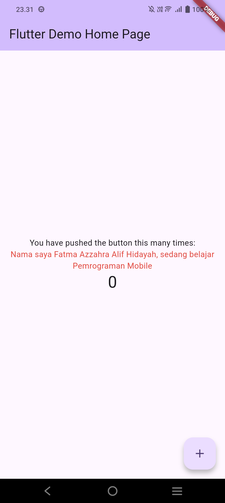
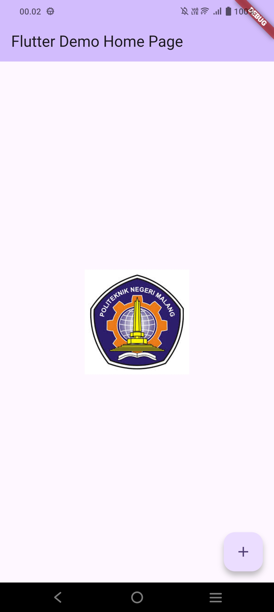
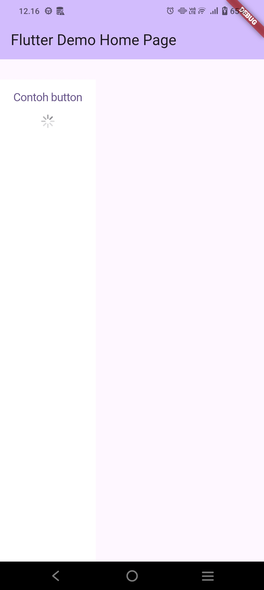
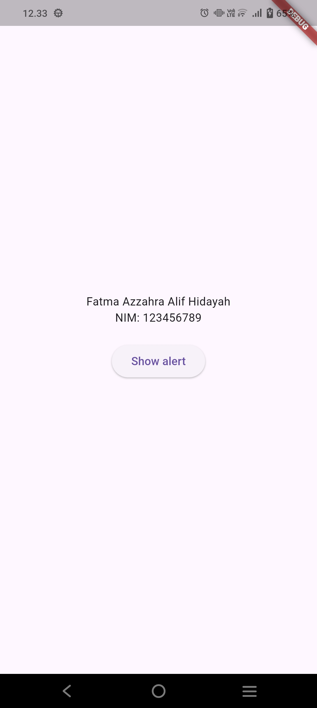
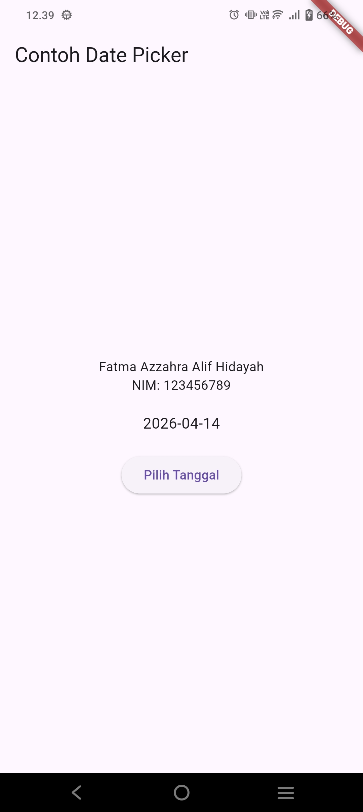
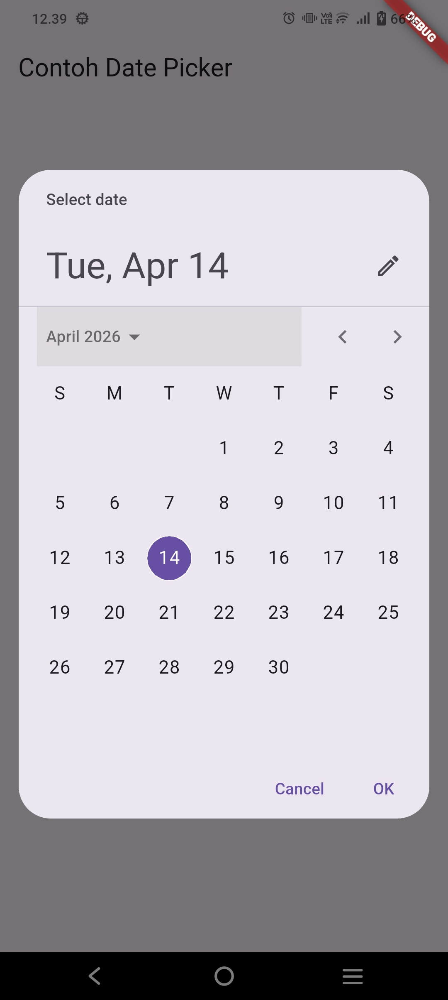

# hellow_world
## A New Flutter Project
 
A new Flutter project.
Nama : Fatma Azzahra Alif Hidayah
NIM  : 244107060046
Github : https://github.com/Fatmaazzahra24/

# Praktikum 4 & 5 - Flutter Widget Dasar

## Praktikum 4

### Langkah 1: Text Widget
Pada langkah ini digunakan **Text widget** untuk menampilkan teks sederhana di layar aplikasi Flutter.

### Langkah 2: Image Widget
Menampilkan gambar menggunakan **Image widget** baik dari asset lokal maupun internet.

---------------------------------------
## Praktikum 5

### Langkah 1: Cupertino Button
Pada langkah ini digunakan **CupertinoButton** yang merupakan button dengan gaya iOS pada Flutter.

### Langkah 2: Floating Action Button
FloatingActionButton digunakan sebagai tombol aksi utama yang biasanya berada di pojok bawah layar.

### Langkah 3: Scaffold
Scaffold digunakan sebagai struktur dasar halaman yang menyediakan AppBar, body, dan komponen lainnya.

### Langkah 4: Dialog
Dialog digunakan untuk menampilkan popup atau pesan kepada pengguna.

### Langkah 5: Input dan Selection Widget
Widget ini digunakan untuk menerima input dari pengguna seperti TextField, Checkbox, dan lainnya.

### Langkah 6: Date and Time Picker
Digunakan untuk memilih tanggal dan waktu melalui widget picker.

